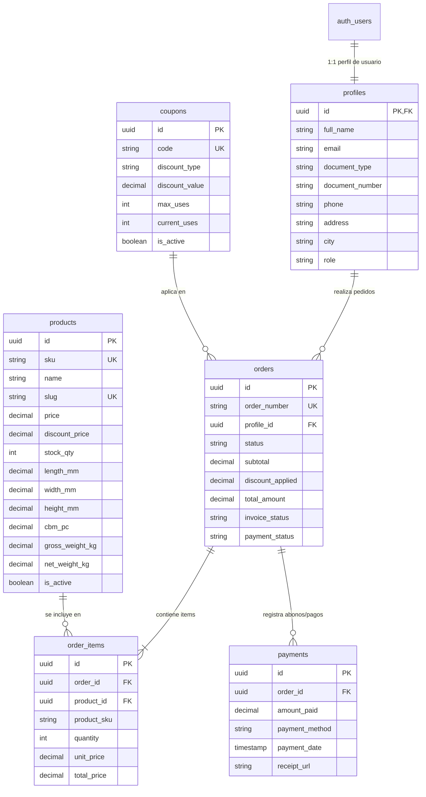

# 📘 DOCUMENTACIÓN ARQUITECTÓNICA DE LA BASE DE DATOS — FERREINTER E-COMMERCE

> **Estado:** Fase 3 — Rediseño Arquitectónico y Esquema DDL Final  
> **Motor:** PostgreSQL (Supabase)  
> **Principio Clave:** Supabase como Única Fuente de Verdad (Single Source of Truth), RLS Atómico y Control Transaccional de Inventario.

---

## 📑 TABLA DE CONTENIDOS
1. [Visión General de la Arquitectura](#1-visión-general-de-la-arquitectura)
2. [Diagrama de Entidad-Relación (ERD)](#2-diagrama-de-entidad-relación-erd)
3. [Diccionario de Datos y Tablas](#3-diccionario-de-datos-y-tablas)
   - [profiles (Usuarios & Facturación DIAN)](#1-profiles)
   - [products (Inventario & Especificaciones de Importación)](#2-products)
   - [coupons (Cupones de Descuento)](#3-coupons)
   - [orders (Encabezado de Pedidos & Factura Electrónica)](#4-orders)
   - [order_items (Detalle del Pedido)](#5-order_items)
   - [payments (Historial de Abonos y Pagos)](#6-payments)
4. [Políticas de Seguridad (Row Level Security - RLS)](#4-políticas-de-seguridad-row-level-security---rls)
5. [Procedimiento Almacenado RPC (`process_checkout`)](#5-procedimiento-almacenado-rpc-process_checkout)
6. [Credenciales y Parámetros del Proyecto](#6-credenciales-y-parámetros-del-proyecto)

---

## 1. VISIÓN GENERAL DE LA ARQUITECTURA

El sistema de base de datos de **FERREINTER** está construido bajo estándares industriales de e-commerce e importaciones:

- **UUIDs v4 Agnósticos:** Llaves primarias universales para evitar colisiones y secuencias predecibles.
- **Descuento de Inventario Atómico:** React/Cliente jamás descuenta stock haciendo `UPDATE` directo. El proceso se realiza a través de la función RPC `process_checkout` con bloqueos pesimistas `FOR UPDATE` para evitar sobreventas concurrentes.
- **Facturación Electrónica DIAN:** Modelado preparado para integración con proveedores de Facturación Electrónica en Colombia (tipo y número de documento, estado de factura, ID externo y URL del PDF).
- **Control de Abonos Parciales:** Estructura modular en la tabla `payments` que soporta múltiples pagos/abonos para un mismo pedido.

---

## 2. DIAGRAMA DE ENTIDAD-RELACIÓN (ERD)



---

## 3. DICCIONARIO DE DATOS Y TABLAS

### 1. `profiles`
Almacena la información extendida de los usuarios autenticados.

| Campo | Tipo | Restricción | Descripción |
| :--- | :--- | :--- | :--- |
| `id` | `UUID` | `PK`, `FK (auth.users.id ON DELETE CASCADE)` | ID del usuario autenticado |
| `full_name` | `TEXT` | `NOT NULL` | Nombre completo o Razón Social |
| `email` | `TEXT` | `NOT NULL, UNIQUE` | Correo electrónico principal |
| `document_type` | `TEXT` | `CHECK (CC, NIT, CE, PASAPORTE, TI, RUT)` | Tipo de documento para DIAN |
| `document_number`| `TEXT` | — | Número de identificación / NIT |
| `phone` | `TEXT` | — | Teléfono móvil o fijo |
| `address` | `TEXT` | — | Dirección física de entrega / facturación |
| `city` | `TEXT` | — | Ciudad de residencia |
| `role` | `TEXT` | `DEFAULT 'customer' CHECK (admin, collaborator, customer)` | Rol de acceso dentro del sistema |
| `created_at` | `TIMESTAMPTZ` | `DEFAULT now()` | Fecha de creación del registro |
| `updated_at` | `TIMESTAMPTZ` | `DEFAULT now()` | Última actualización |

---

### 2. `products`
Almacena el catálogo de herramientas y productos industriales con soporte para datos de importación (Packing List).

| Campo | Tipo | Restricción | Descripción |
| :--- | :--- | :--- | :--- |
| `id` | `UUID` | `PK, DEFAULT gen_random_uuid()` | Identificador único de producto |
| `sku` | `TEXT` | `NOT NULL, UNIQUE` | Código Item No / SKU único |
| `name` | `TEXT` | `NOT NULL` | Nombre comercial del producto |
| `slug` | `TEXT` | `NOT NULL, UNIQUE` | URL amigable |
| `price` | `NUMERIC(12,2)` | `NOT NULL, CHECK (>= 0)` | Precio regular en COP |
| `discount_price` | `NUMERIC(12,2)` | `CHECK (NULL OR < price)` | Precio en oferta (si aplica) |
| `stock_qty` | `INT` | `NOT NULL, DEFAULT 0, CHECK (>= 0)` | Existencias reales en inventario |
| `length_mm` | `NUMERIC(10,2)` | — | Largo en milímetros |
| `width_mm` | `NUMERIC(10,2)` | — | Ancho en milímetros |
| `height_mm` | `NUMERIC(10,2)` | — | Alto en milímetros |
| `package_details`| `TEXT` | — | Especificaciones de empaque / caja |
| `cbm_pc` | `NUMERIC(10,6)` | — | Volumen CBM por pieza |
| `gross_weight_kg`| `NUMERIC(10,3)` | — | Peso bruto en Kilogramos |
| `net_weight_kg` | `NUMERIC(10,3)` | — | Peso neto en Kilogramos |
| `images` | `TEXT[]` | `DEFAULT '{}'` | Enlaces a imágenes en Supabase Storage |
| `is_active` | `BOOLEAN` | `DEFAULT true` | Estado de publicación en tienda |

---

### 3. `coupons`
Cupones de descuento configurables.

| Campo | Tipo | Restricción | Descripción |
| :--- | :--- | :--- | :--- |
| `id` | `UUID` | `PK` | Identificador único del cupón |
| `code` | `TEXT` | `NOT NULL, UNIQUE` | Código promocional (ej. `FERRE20`) |
| `discount_type` | `TEXT` | `NOT NULL, CHECK (percentage, fixed)` | Tipo de descuento |
| `discount_value`| `NUMERIC(12,2)` | `NOT NULL, CHECK (> 0)` | Porcentaje o monto fijo a descontar |
| `max_uses` | `INT` | `DEFAULT 100` | Límite máximo de redenciones |
| `current_uses` | `INT` | `DEFAULT 0, CHECK (>= 0)` | Usos acumulados actuales |
| `expires_at` | `TIMESTAMPTZ` | — | Fecha límite de validez |
| `is_active` | `BOOLEAN` | `DEFAULT true` | Estado del cupón |

---

### 4. `orders`
Encabezado de los pedidos generados.

| Campo | Tipo | Restricción | Descripción |
| :--- | :--- | :--- | :--- |
| `id` | `UUID` | `PK` | Identificador único del pedido |
| `order_number` | `TEXT` | `NOT NULL, UNIQUE` | Código consecutivo (ej. `FERRE-20261001-A1B2C`) |
| `profile_id` | `UUID` | `FK (profiles.id)` | Usuario comprador |
| `status` | `TEXT` | `DEFAULT 'pending' CHECK (...)` | Estado: `pending`, `processing`, `shipped`, `delivered`, `cancelled` |
| `subtotal` | `NUMERIC(12,2)` | `NOT NULL, CHECK (>= 0)` | Subtotal antes de descuentos |
| `discount_applied`| `NUMERIC(12,2)`| `DEFAULT 0` | Descuento total aplicado |
| `total_amount` | `NUMERIC(12,2)` | `NOT NULL, CHECK (>= 0)` | Total final a pagar |
| `invoice_status` | `TEXT` | `DEFAULT 'pending' CHECK (...)` | Estado de factura DIAN: `pending`, `generated`, `failed` |
| `payment_status` | `TEXT` | `DEFAULT 'pending' CHECK (...)` | Estado de pago: `pending`, `partial_payment`, `paid_in_full` |

---

### 5. `order_items`
Líneas de detalle de cada producto en un pedido.

| Campo | Tipo | Restricción | Descripción |
| :--- | :--- | :--- | :--- |
| `id` | `UUID` | `PK` | ID del ítem |
| `order_id` | `UUID` | `FK (orders.id ON DELETE CASCADE)` | Pedido al que pertenece |
| `product_id` | `UUID` | `FK (products.id ON DELETE RESTRICT)`| Producto comprado |
| `product_sku` | `TEXT` | `NOT NULL` | Copia del SKU al momento de compra |
| `quantity` | `INT` | `NOT NULL, CHECK (> 0)` | Unidades adquiridas |
| `unit_price` | `NUMERIC(12,2)` | `NOT NULL` | Precio unitario aplicado |
| `total_price` | `NUMERIC(12,2)` | `NOT NULL` | Total de la línea (`quantity * unit_price`) |

---

### 6. `payments`
Registro de abonos o pagos realizados a un pedido.

| Campo | Tipo | Restricción | Descripción |
| :--- | :--- | :--- | :--- |
| `id` | `UUID` | `PK` | ID del pago |
| `order_id` | `UUID` | `FK (orders.id ON DELETE CASCADE)` | Pedido asociado |
| `amount_paid` | `NUMERIC(12,2)` | `NOT NULL, CHECK (> 0)` | Valor abonado o pagado |
| `payment_method` | `TEXT` | `NOT NULL` | Medio (`transfer`, `wompi`, `pse`, `cash`) |
| `receipt_url` | `TEXT` | — | URL del comprobante de transferencia |
| `payment_date` | `TIMESTAMPTZ` | `DEFAULT now()` | Fecha de ejecución del pago |

---

## 4. POLÍTICAS DE SEGURIDAD (ROW LEVEL SECURITY - RLS)

Todas las tablas poseen **RLS activo**:

- **Productos (`products`):** Lectura pública para productos activos. Modificaciones reservadas exclusivamente para usuarios con rol `admin` o `collaborator`.
- **Perfiles (`profiles`):** Cada usuario solo puede consultar y editar su propio perfil (`auth.uid() = id`). Los administradores pueden gestionar todos los perfiles.
- **Pedidos (`orders` y `order_items`):** Los clientes solo pueden consultar sus propios pedidos.
- **Cupones (`coupons`):** Consulta pública de cupones válidos. Edición restringida a `admin`.

---

## 5. PROCEDIMIENTO ALMACENADO RPC (`process_checkout`)

La función `process_checkout` procesa la compra atómicamente:

```sql
SELECT public.process_checkout(
  p_profile_id := 'uuid-del-usuario',
  p_items := '[{"product_id": "uuid-producto-1", "quantity": 2}]'::jsonb,
  p_coupon_code := 'FERRE20',
  p_shipping_address := '{"direccion": "Calle 10 # 20-30", "ciudad": "Bogotá"}'::jsonb
);
```

### Flujo de Ejecución Interno:
1. **Bloqueo Pesimista:** Ejecuta `SELECT ... FOR UPDATE` sobre los productos solicitados para bloquear la fila contra escrituras simultáneas.
2. **Validación de Stock:** Verifica que `stock_qty >= quantity`. Si algún producto no tiene existencias, emite un `RAISE EXCEPTION` abortando toda la transacción.
3. **Validación de Cupón:** Comprueba validez, fecha de expiración y límite de usos (`max_uses`), e incrementa `current_uses`.
4. **Inserción de Pedido:** Crea el registro en `orders` y sus respectivas líneas en `order_items`.
5. **Descuento de Inventario:** Resta `stock_qty = stock_qty - quantity` atómicamente en la base de datos.
6. **Retorno:** Devuelve una respuesta JSON estructurada con `order_id`, `order_number` y totales.

---

## 6. CREDENCIALES Y PARÁMETROS DEL PROYECTO

- **URL Supabase:** `https://clufybkujyzhzffpymti.supabase.co`
- **Llave Pública (Anon Key):** `eyJhbGciOiJIUzI1NiIsInR5cCI6IkpXVCJ9...`
- **Archivo DDL del Proyecto:** [supabase/schema.sql](file:///Users/macbook/Desktop/FERRE%20INTER/supabase/schema.sql)
